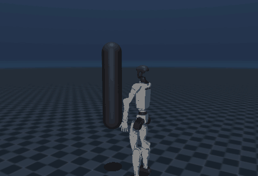
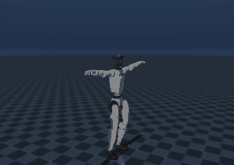

# striking-robot-twin


-red)

Digital-twin-first control stack for a stationary boxing/Muay Thai training
robot. The robot throws padded punches at a trainee and uses computer vision to
teach them to dodge and defend.

<p align="center">
  
  
</p>
<p align="center">
  <sub><b>Left:</b> an authored <code>jab, jab, cross, hook</code> combo on the Unitree G1.
  <b>Right:</b> real LAFAN1 fight motion capture replayed on the same robot.</sub>
</p>

Safety (physical human-robot interaction) is the design constraint that
organises the architecture, not a module bolted on. See `CLAUDE.md` for the full
context, the safety contract and the roadmap.

## Status

| Phase | Deliverable | State |
|-------|-------------|-------|
| 0 | Foundations + safety (HAL, SafetyArbiter, sim plant, env) | ✅ |
| 1 | Perception (DodgeDetector, GuardDetector) | ✅ |
| 2 | Slow closed loop (telegraphed strikes, scoring) | ✅ |
| 3.1 | Multi-striker, combos and curriculum | ✅ |
| 3.2 | Motion mining (mocap/video → combo grammar) | ⏳ |
| 3.3 | RL / MJX scaled training | ⏳ |

All intelligence is built and validated in a MuJoCo digital twin before any
hardware or human. The sim and the real robot are interchangeable behind a
Hardware Abstraction Layer (HAL); nothing above the HAL knows which it talks to.

MVP scope: punches only (jab, cross, hook), upper body. No kicks, knees, elbows
or footwork.

## Architecture (plant-agnostic HAL)

```
Services : DrillEngine + DrillSession, Curriculum, Scoring, Telemetry
Domain   : StrikePlanner, TargetSelector, DodgeDetector, GuardDetector, ComboGrammar
Safety   : SafetyArbiter (keep-out, reach, force cap, latency margin), FaultInjector
---------------------- HAL boundary (sim <-> real) ----------------------
Interfaces : IRobotPlant, ITraineeObserver, IOpponent   (typing.Protocol)
   sim     : MujocoPlant, SimGTObserver, ScriptedTrainee
   real    : RealPlant (STM32), CameraPoseObserver (Jetson)   [stubs]
```

Hard rule: Domain, Safety and Services never import `mujoco`, `jax` or `cv2`.
They depend only on `hal.interfaces` and `core.types`.

### The keep-out math (central)

The protected volume around the head is inflated by system latency, because the
head moves between estimating it and stopping the actuator:

```
R_keepout = tracking_error + (latency_total * head_v_max) + margin
```

The `SafetyArbiter` recomputes this every cycle from the observer's live latency
and vetoes any command whose trajectory crosses an inflated protected sphere. The
`DrillEngine` re-checks it on every control tick and e-stops if the trainee
lunges in, so no strike is ever executed into a violation.

## Visual body: Unitree G1

The control and safety stack is plant-agnostic, so the robot's body can be
anything that satisfies the HAL. For realistic visualisation we drive the
official **Unitree G1** humanoid (MuJoCo Menagerie, BSD-3) as a stationary
striker, and we can replay **real fight motion capture** on it (LAFAN1 retargeted
to the G1). This follows the project principle: mine the high-level motion, do
not copy joint trajectories.

The G1 meshes (~35 MB) are not committed; fetch them on demand:

```
python scripts/fetch_g1.py                              # G1 model + one fight clip
python scripts/render_combo_g1.py jab,jab,cross,hook    # authored combo -> GIF
python scripts/render_mocap.py data/mocap/fight1_subject3.csv   # real mocap -> GIF
```

## Setup (Windows native, uv)

```
uv venv
uv pip install -e ".[dev]"
```

JAX+GPU / MJX scaled training does not run on native Windows; use WSL2 or Linux
for that (Phase 3.3). Develop the logic on Windows, train heavy on Linux.

## Commands

```
pytest                                   # 86 tests: safety, perception, loop, combos
python scripts/run_sim.py                # safety demo (keep-out veto + force-cap abort)
python scripts/run_drill.py              # full stack: 2 arms, combos, curriculum, safety
python scripts/viewer.py models/scene.xml          # interactive 3D viewer
python -m robot_twin.rl.train            # RL training (Phase 3.3, stub)
```

## Quality gates (enforced by tests)

- **Phase 0:** the SafetyArbiter rejects 100% of commands that violate keep-out /
  reach / force under fault injection (high latency, keypoint dropout, lunge).
- **Phase 1:** dodge/guard detection holds ≥99% under injected pose noise.
- **Phase 2/3.1:** the closed loop trains end to end with **zero unsafe steps**
  across every trainee behaviour; lunges are always safely aborted.

## Tooling

`ruff` (lint + format) and `pre-commit` run lint/format on commit and the full
test suite on push. CI (GitHub Actions) runs ruff + pytest on every PR and push
to `main`.

## Credits

- Robot model: [Unitree G1](https://github.com/google-deepmind/mujoco_menagerie/tree/main/unitree_g1)
  from MuJoCo Menagerie (BSD-3-Clause).
- Fight motion: [LAFAN1 Retargeting Dataset](https://huggingface.co/datasets/lvhaidong/LAFAN1_Retargeting_Dataset)
  (Unitree / lvhaidong), retargeted to the G1.
